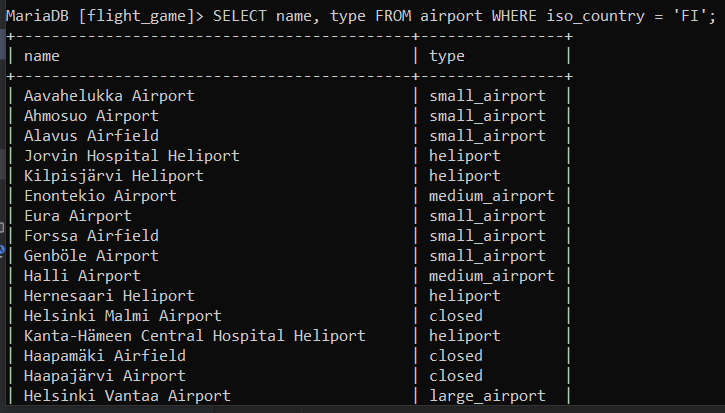
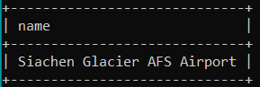

# Yhteen tauluun kohdistuvien kyselyiden harjoitukset

### Tehtävä 1
SELECT * FROM goal;

### Tehtävä 2
SELECT name, type FROM airport WHERE iso_country = 'FI';

### Tehtävä 3
SELECT name FROM airport WHERE iso_country = 'FI' ORDER BY name ASC;

### Tehtävä 4
SELECT name, type FROM airport WHERE iso_country = 'FI' ORDER BY type ASC, name ASC;

### Tehtävä 5
SELECT name FROM country WHERE name LIKE 'F%';

### Tehtävä 6
SELECT name FROM country WHERE name LIKE '%F%';

### Tehtävä 7
SELECT locationFROM game WHERE screen_name = 'Vesa';

### Tehtävä 8
SELECT co2_consumed FROM game WHERE screen_name = 'Ilkka';

### Tehtävä 9
SELECT co2_budget FROM game WHERE screen_name = 'Vesa';

# Where-osan liitosehto harjoitukset

### Tehtävä 1
SELECT 
    country.name AS "country name",
    airport.name AS "airport name"
FROM 
    country
JOIN 
    airport ON country.iso_country = airport.iso_country
WHERE 
    country.name = 'Iceland';

### Tehtävä 2
SELECT 
    airport.name AS "airport name"
FROM 
    country
JOIN 
    airport ON country.iso_country = airport.iso_country
WHERE 
    country.name = 'France' AND airport.type = "large_airport";

### Tehtävä 3
SELECT 
    country.name AS "country_name",
    airport.name AS "airport_name"
FROM 
    country
JOIN 
    airport ON country.iso_country = airport.iso_country
WHERE 
    country.continent = "AN";

### Tehtävä 4
SELECT 
    airport.elevation_ft 
FROM 
    game
JOIN 
    airport ON game.location = airport.ident
WHERE 
    game.screen_name= 'Heini';

### Tehtävä 5
SELECT 
    airport.elevation_ft * 0.3048 AS elevation_m
FROM 
    game
JOIN 
    airport ON game.location = airport.ident
WHERE 
    game.screen_name = 'Heini';

### Tehtävä 6
SELECT 
    airport.name
FROM 
    game
JOIN 
    airport ON game.location = airport.ident
WHERE 
    game.screen_name = 'Ilkka';

### Tehtävä 7
SELECT 
    country.name
FROM 
    game
JOIN 
    airport ON game.location = airport.ident
JOIN
    country ON country.iso_country = airport.iso_country
WHERE 
    game.screen_name = 'Ilkka';

### Tehtävä 8
SELECT 
    goal.name
FROM 
    game
JOIN
    goal_reached ON goal_reached.game_id = game.id
JOIN
    goal ON goal.id = goal_reached.goal_id
WHERE 
    game.screen_name = 'Heini';

### Tehtävä 9
SELECT 
    airport.name
FROM 
    game
JOIN 
    airport ON game.location = airport.ident
JOIN
    country ON country.iso_country = airport.iso_country
WHERE 
    game.screen_name = 'Ilkka';

### Tehtävä 10
SELECT 
    country.name
FROM 
    game
JOIN 
    airport ON game.location = airport.ident
JOIN
    country ON country.iso_country = airport.iso_country
WHERE 
    game.screen_name = 'Ilkka';

# Join harjoitukset

### Tehtävä 1
SELECT 
    country.name AS "country name",
    airport.name AS "airport name"
FROM 
    country
JOIN 
    airport ON country.iso_country = airport.iso_country
WHERE 
    country.name = 'Finland' AND airport.scheduled_service = "yes";

### Tehtävä 2
SELECT 
    game.screen_name,
    airport.name
FROM 
    game
JOIN 
    airport ON game.location = airport.ident;

### Tehtävä 3
SELECT 
    game.screen_name,
    country.name
FROM 
    game
JOIN 
    airport ON game.location = airport.ident
JOIN
    country ON country.iso_country = airport.iso_country;

### Tehtävä 4
SELECT 
    airport.name,
    game.screen_name
FROM 
    airport
LEFT JOIN 
    game ON airport.ident = game.location
WHERE 
    airport.name LIKE '%Hels%';

### Tehtävä 5
SELECT 
    goal.name,
    game.screen_name
FROM 
    goal
LEFT JOIN 
    goal_reached ON goal.id = goal_reached.goal_id
LEFT JOIN 
    game ON game.id = goal_reached.game_id;

# Sisäkysely harjoitukset

### Tehtävä 1
SELECT 
    country.name
FROM 
    airport
JOIN
    country ON country.iso_country = airport.iso_country
WHERE 
    airport.name LIKE 'Satsuma%';

### Tehtävä 2
SELECT 
    airport.name
FROM 
    airport
JOIN
    country ON country.iso_country = airport.iso_country
WHERE 
    country.name = "Monaco";

### Tehtävä 3
SELECT 
    game.screen_name
FROM 
    game
JOIN
    goal_reached ON goal_reached.game_id = game.id
JOIN
    goal ON goal.id = goal_reached.goal_id
WHERE 
    goal.name = 'CLOUDS';

### Tehtävä 4
SELECT 
    country.name
FROM 
    country
LEFT JOIN 
    airport ON country.iso_country = airport.iso_country
WHERE 
    airport.iso_country IS NULL;

### Tehtävä 5
SELECT 
    goal.name
FROM 
    goal
WHERE 
    goal.id NOT IN (
        SELECT 
            goal.id
        FROM 
            goal
        LEFT JOIN 
            goal_reached ON goal.id = goal_reached.goal_id
        LEFT JOIN 
            game ON goal_reached.game_id = game.id
        WHERE 
            game.screen_name = 'Heini'
    );

# Koostetieto kyselyt harjoitukset

### Tehtävä 1
SELECT 
    MAX(airport.elevation_ft) AS "max(elevation_ft)"
FROM 
    airport;

### Tehtävä 2
SELECT 
    country.continent AS continent,
    COUNT(country.iso_country) AS "count(*)"
FROM 
    country
GROUP BY 
    country.continent;

### Tehtävä 3
SELECT 
    game.screen_name,
    COUNT(goal_reached.goal_id) AS "count(*)"
FROM 
    goal_reached
LEFT JOIN 
    game ON goal_reached.game_id = game.id
GROUP BY 
    game.screen_name;

### Tehtävä 4
SELECT 
    game.screen_name
FROM 
    game
WHERE 
    game.co2_budget = (SELECT MIN(game.co2_budget) FROM game)
LIMIT 1;

### Tehtävä 5
SELECT 
    country.name,
    COUNT(airport.ident) AS "count(*)"
FROM 
    country
LEFT JOIN 
    airport ON country.iso_country = airport.iso_country
GROUP BY 
    country.name
ORDER BY 
    COUNT(airport.ident) DESC,
    country.name ASC
LIMIT 50;

### Tehtävä 6
SELECT 
    country.name
FROM 
    country
LEFT JOIN 
    airport ON country.iso_country = airport.iso_country
GROUP BY 
    country.iso_country, country.name
HAVING 
    COUNT(airport.ident) > 1000;

### Tehtävä 7
SELECT 
    name
FROM 
    airport
WHERE 
    elevation_ft = (SELECT MAX(elevation_ft) FROM airport);

### Tehtävä 8
SELECT 
    country.name 
FROM 
    country
LEFT JOIN 
    airport ON country.iso_country = airport.iso_country
WHERE 
    airport.elevation_ft = (SELECT MAX(elevation_ft) FROM airport);

### Tehtävä 9
SELECT 
    COUNT(*) AS "count(*)"
FROM 
    goal_reached
LEFT JOIN 
    game ON goal_reached.game_id = game.id
WHERE 
    game.screen_name = 'Vesa';

### Tehtävä 10
SELECT 
    name
FROM 
    airport
ORDER BY 
    ABS(latitude_deg) DESC
LIMIT 1;

